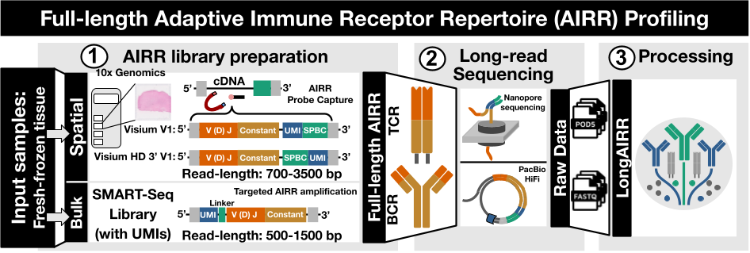
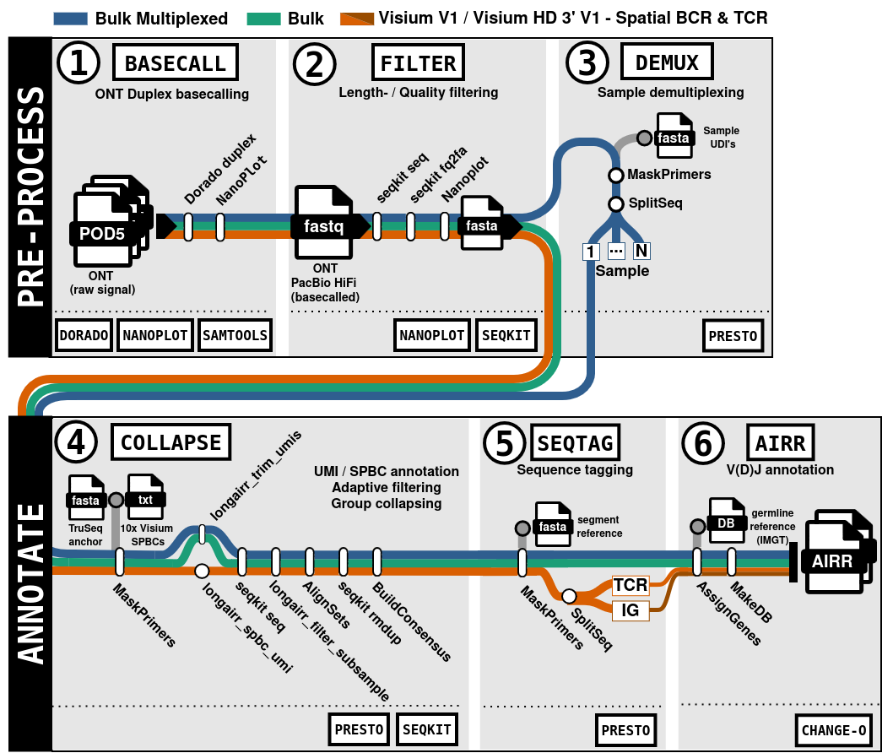
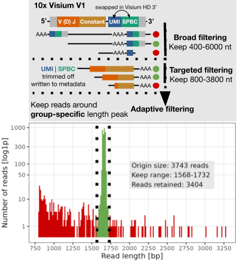

[](https://lifecycle.r-lib.org/articles/stages.html#experimental)
[](#installation-and-setup)

# LongAIRR 

<a href=""><a>

We present **LongAIRR**, a novel bioinformatic workflow 
designed to annotate full-length immunoglobulin and T cell receptor sequencing data
at both bulk and spatial transcriptomic level.
**LongAIRR** combines high-accuracy basecalling, Unique Molecular Identifiers (UMIs), 
and established tools from the [Immcantation framework](https://immcantation.readthedocs.io/en/stable/)
to reliably generate antigen receptor sequences from long-read sequencing data.

<p align="center">
  
</p>

___

## Table of Content
* [Installation and Setup](#installation-and-setup)
  * [Prerequisites](#prerequisites)
    * [Install Conda / Mamba](#install-conda--mamba)
  * [LongAIRR Installation and Setup](#longairr-installation-and-setup)
  * [Deinstallation](#deinstallation)
* [LongAIRR Software Overview](#longairr-software-overview)
  * [LongAIRR basecall](#1-longairr-basecall)
  * [LongAIRR filter](#2-longairr-filter)
  * [LongAIRR demux](#3-longairr-demux)
  * [LongAIRR collapse](#4-longairr-collapse)
  * [LongAIRR seqtag](#5-longairr-seqtag)
  * [LongAIRR airr](#6-longairr-airr)
  * [Read Summary](#Read-Summary)
* [Extended documentation](#extended-documentation)
* [Citation](#Citation)
* [Authors / Contact](#authors)
  
___

# Installation and Setup

Follow the steps below to install, set up and, if necessary, deinstall the LongAIRR software.

## Prerequisites

### Install Conda / Mamba 

Install Mambaforge (a Conda-based environment manager) using the following commands:

Follow the on-screen information during Miniforge's installation. More information can be found [**here**](https://github.com/conda-forge/miniforge/)
```markdown
curl -L -O "https://github.com/conda-forge/miniforge/releases/latest/download/Miniforge3-$(uname)-$(uname -m).sh"

bash Miniforge3-$(uname)-$(uname -m).sh
conda activate base
```

## LongAIRR Installation and Setup

### Download Repository

Create a directory for LongAIRR and download the repository:

```markdown
mkdir -d path/to/longairr
cd path/to/longairr

curl -u github-username:token -L https://github.com/AGImkeller/AIRR_workflow/archive/refs/heads/visium_hd.zip -o longairr.zip
unzip longairr.zip
```

### Run install.sh

Use the **install.sh** script to set up **LongAIRR**. You have the options to download
the required databases and set up the software environment.

Key Options:
-  `--fetch-db TRUE`: Downloads the required IMGT/IgBlast reference database.
-  `--db-dir [path]`: Specifies the directory to store the reference database.
-  `--species [name]`: Specifies the species for the IMGT reference (e.g., human or mouse).
-  `--env TRUE|FALSE`: Sets up 'longairr' conda environment

> [!Tip]
> To view all available parameter options, run:
>
> ```markdown
> bash install.sh --help

The path to the *longairr_scripts* directory in the downloaded folder is a required
input. The script installs all scripts to *$HOME/.local/bin/longairr*, updates 
the PATH variable, and makes the software executable on the whole system. However,
you will only be able to run the functionalities in the activated conda environment.

**Example commands**

```markdown
cd path/to/longairr

#full example
bash install.sh --fetch-db TRUE --db-dir ./ --species human --env true ./longairr_scripts/

#short example (no reference download)
bash install.sh
```
> [!Important]
> After completion, restart your terminal or refresh the current session with the command:
> ```markdown
> source $HOME/.bashrc

### Activate conda environment and run LongAIRR

Activate the 'longairr' conda environment required to run the LongAIRR functions:

```markdown
conda env list
conda activate longairr
```
> [!Important]
> Verify the installation and run the following command to confirm that longairr is properly
> installed. Be sure the 'longairr' conda-environment is activated
> ```
> longairr --version
> longairr --help

## Deinstallation

To uninstall *LongAIRR*, follow these steps:
Ensure the 'longairr' conda environment is **not** activated,
Next, navigate to the directory containing the **deinstall.sh** script and run it.
```markdown
conda deactivate

cd path/to/longairr/
bash deinstall.sh
```
This script will remove the 'longairr' conda environment. Delete the
*$HOME/.local/bin/longairr/* directory and removes the corresponding entry from your *PATH*.

To fully clean up, you can delete the downloaded nanoairr directory afterwards.
___
[**BACK TO TOP**](#Table-of-Content)
___

# LongAIRR Software Overview:

This section contains a brief description of the overall functionality of each core module.

LongAIRR can process reads generated with the following library-protocols (see Fig. 1):

  * [10x Visium V1 - Spatial Gene Expression Vers.: CG000239 RevF](https://www.10xgenomics.com/support/spatial-gene-expression-fresh-frozen/documentation/steps/library-construction/visium-spatial-gene-expression-reagent-kits-user-guide)
  * [10x Visium HD 3' - Spatial Gene Expression Vers.: CG000805 RevB](https://www.10xgenomics.com/support/spatial-gene-expression-hd-three-prime/documentation/steps/library-construction/visium-hd-3-prime-spatial-gene-expression-user-guide)
  * [SMART-Seq Human BCR (with UMIs)](https://www.takarabio.com/products/next-generation-sequencing/immune-profiling/human-repertoire/smart-seq-human-bcr-with-umis?srsltid=AfmBOoqz0SB9vJtwLHpGINeMqu9hOhdTcYTiH2PtZP4P2h7OG2y7NGmy)

For detailed information regarding the file-/directory output structure, please vitis the **Example scripts** and **Output structure** section in the [**extended documentation**](#extended-documentation).

> [!Important]
> Consider checking the related software-documentation [*`longairr --help`*] or module-specific help functions, e.g., [*`longairr collapse --help`*] to get detailed parameter information and **example-use-cases**:
> ```markdown
> (longairr_env) user@laptop:~$ longairr --help
>
>  longairr version: 7.5
>  
>  Usage: longairr [MODUL] [OPTIONS]
>  
>  Description: 
>  
>  Modules:
>    basecall       |  Perform Nanopore basecalling and generate a quality report
>    filter         |  [OPTIONAL] Perform Quality/length filtering and generate a quality report
>    demux          |  [OPTIONAL] Perform Sample demultiplexing on bulk samples
>    collapse       |  Perform annotation of UMI / Spatial barcode sequences,
>                      collapse sequences on specified GROUP field by running MSA and Consensus building
>    seqtag         |  [OPTIONAL] Perform annotation of the constant region or other provided anchor sequences
>    airr           |  Assign V(D)J genes + conversion to AIRR-conform output
>    -h, --help     |  Show this help message and exit
>    -v, --version  |  Show version information and exit

<figure align="center">
    
    <figcaption>Figure 2: LongAIRR Software Modules.</figcaption>
</figure>

### (1) **longairr basecall**
**longairr basecall**, integrates the [Oxford Nanopore Technologies Dorado duplex basecaller](https://github.com/nanoporetech/dorado?tab=readme-ov-file) to process raw nanopore sequencing reads in ONT’s pod5 format (Figure 2, Module 1). *Dorado duplex* generates duplex reads, in which both complementary cDNA strands of a molecule are sequenced, as well as simplex reads derived form a single strand. Read classification is encoded in the dx BAM tag: dx:1 denotes a duplex read, dx:0 denotes a simplex read without duplex offspring, and dx:-1 denotes a simplex read for which a corresponding duplex read was successfully generated. 
The [Dorado basecaller](https://github.com/nanoporetech/dorado?tab=readme-ov-file)
is optimized for GPU usage and currently does not support CPU-only processing. 
We recommend running this step on a dedicated GPU server, as the processing
time can range from several hours to days, depending on the number of generated raw
nanopore long-read sequences.

Users can specify the read-types to retain for LongAIRR processing [`--simplex TRUE|FALSE`], [`--duplex TRUE|FALSE`], the basecalling model, e.g., [`--model sup`] and the corresponding
GPU to perform basecalling on [`--cuda cuda:all`].

Additionally, a quality report on the raw data is generated using [NanoPlot](https://github.com/wdecoster/nanoplot)

> [!Tip]
> 1. For detailed parameter descriptions run [*`longairr basecall --help`*]
>
> 2. Refer to the [dorado documentation](https://github.com/nanoporetech/dorado?tab=readme-ov-file) for detailed information regarding basecalling models.

___

### (2) **longairr filter**
The second module, **longairr filter**, applies customizable quality and length thresholds [`--min-qual, --minl, --maxl`] to FASTQ files in order to retain high-quality reads and reduce computational load in subsequent steps. In contrast to the basecalling module, this step works **platform-agnostic** and can **process FASTQ files generated by ONT as well as HiFi reads from PacBio sequencing (Figure 2, Module 2)**.

> [!Tip]
> 1. For detailed parameter descriptions run [*`longairr filter --help`*]

___

### (3) **longairr demux**
**longairr demux** performs demultiplexing on multiplexed bulk samples using
Unique Duplex Identifiers (UDIs). It requires a FASTA file containing the UDI 
sequences as input. This *step is optional*, but it is crucial for correctly 
assigning reads to their respective samples.

> [!Tip]
> 1. For detailed parameter descriptions run [*`longairr demux --help`*]
>
> 2. For optimal results, the `bulk_runX_barcodes.fasta` file should only contain the 
barcode/UDI sequences used in the specific sequencing run. Including unused barcodes 
may cause reads to cross-map incorrectly, potentially reducing the number of 
properly assigned reads.
>
> Example of `bulk_runX_barcodes.fasta`:
> ```
> >UID12
> GACGAGAG
> >UID13
> AGACTTGG

___

### (4) **longairr collapse**
The fourth module, **longairr collapse**, performs annotation of UMIs and, for spatial datasets, SPBCs from 10x Visium V1 or 10x Visium HD 3’ V1 libraries (Figure 1B, Module 4). Annotation requires a FASTA file containing a user-defined UMI anchor sequence, and for spatial datasets, a reference list of valid spatial barcodes provided by 10x Genomics

> [!Important]
> To allow correct annotation of UMI and SPBC sequences depending on the read orientation,
> users need to specify the underlying library used:
>  * **Visium V1:** [`--library visium`]
>  * **Visium HD 3' V1:** [`--library visiumhd`]
>  * **Bulk Takara (with UMIs):**[`--library bulk`]
> Current default in LongAIRR 7.5 is set to [`--library visium`]

Following UMI and SPBC annotation, reads are grouped into sequence groups representing individual molecules [`--group-field`]. For bulk datasets, grouping is performed based on shared UMI sequences. For spatial datasets, grouping is performed using the combined UMI-SPBC identifier to ensure that molecules originating from different spatial locations within the tissue are processed independently.



Prior to consensus building, two complementary filtering strategies can be applied to further reduce noise and remove non-representative reads. The first approach applies fixed-length thresholds,  retaining reads within user-defined bounds [`--minl`, `--maxl`] expected to capture full-length receptor transcripts. In addition, LongAIRR implements an novel **adaptive filtering** strategy within individual sequence groups above a specified minimum size [`--filter-min-size`]. In this step, read-length distributions are evaluated per sequence group, and only reads falling within a defined margin [`--peak-margin`] around the group-specific dominant peak-length (i.e., the most populated length bin) are retained (see Fig. left). By filtering relative to the internal distribution of each group, this approach removes outlier reads while preserving the predominant full-length transcript representation.

To enable scalable processing of large sequence groups, longairr collapse additionally applies a subsampling strategy prior to multiple sequence alignment (MSA). Sequence groups exceeding a user-defined size threshold are reduced to manageable subsets before alignment Following group-specific MSA, reads are partitioned into chunks that preserve complete sequence groups, enabling parallel consensus generation.

Users may configure subsample size [`--n-subsample`], number of groups per chunk [`--n-chunk`], and the level of parallelization to match available computational resources [`--cjobs`]. Read-specific metadata including the annotated UMI and SPBC-sequences, as well as original- [*N_ORIG*], filtered- [*N_KEEP*]and subsampled group-sizes [*CONSENSUS_COUNT*] are annotated in each reads FASTA-header, supporting traceability throughout downstream analysis (**Figure 2, Module 4**)

> [!Tip]
> 1. For detailed parameter descriptions run [*`longairr collapse --help`*]
>
> 2. Example of **bulk_anchor_seq.fasta** for bulk datasets:   
> ```
> Linker_seq
> GTACGGG
> ```
> 3. Example of **spatial_anchor_seq.fasta** for spatial datasets:
> ```
> r1
> CTACACGACGCTCTTCCGATCT

___

### (5) **longairr seqtag**
The **longairr seqtag** module provides flexible anchor-based annotation of additional read segments. For instance, in immunoglobulin-based bulk datasets, constant region anchor can be used to assign isotype-families. In combined immunoglobulin and T cell receptor spatial AIRR libraries, the module enables separation of sequences into locus-specific subsets prior to V(D)J annotation (Figure 2, Module 5). Anchor sequences are user-defined input provided in FASTA format

>[!CAUTION]
> **For Troubleshooting:** If few or no reads are annotated after running longairr seqtag, check the following:
>  - Ensure the specified anchor sequences match the expected constant region sequences for
>    your dataset
>  - Verify the read orientation in relation to your dataset type (bulk or spatial), potentially test the **reverse complement** of the provided anchors

>[!Tip]
> 1. For detailed parameter descriptions run [*`longairr seqtag --help`*]
>
> 2. Example of **spatial_constant.fasta** (x' -> y' orientation):
> ```
> >Ig | 1 | IGHA1
> GCATCCCCGACCAGCCCCAAGGTCTTCCCGCTGAGCCTCTGCAGCACCCAGCCAGATGGG
> >Ig | 2 | IGHA2
> GCATCCCCGACCAGCCCCAAGGTCTTCCCGCTGAGCCTCGACAGCACCCCCCAAGATGGG
> >Ig | 3 | IGHD
> CACCCACCAAGGCTCCGGATGTGTTCCCCATCATATCAGGGTGCAGACACCCAAAGGATA
> >Ig | 4 | IGHE
> GCCTCCACACAGAGCCCATCCGTCTTCCCCTTGACCCGCTGCTGCAAAAACATTCCCTCC
> >Ig | 5 | IGHG1
> GCCTCCACCAAGGGCCCATCGGTCTTCCCCCTGGCACCCTCCTCCAAGAGCACCTCTGGG
> ...
> ```
> 2. Example of **bulk_constant.fasta** (x' -> y' orientation):
> ```
> >IGHM
> ATGCACTCCC
> >IGHG
> TGGTGGAGGC
> >IGHA
> TCGGGGATGC
> >IGHD
> TGGTGGGTGC
> >IGHE
> GTGTGGAGGC
> ```
> Exemplary anchor sequences are custom-built and retrieved from the [IMGT](https://www.imgt.org/) reference database.

___

### (6) **longairr airr**
The final module, **longairr airr**, performs loci-specific annotation of V(D)J and constant gene segments. User-specified IMGT germline references can be configured during LongAIRR installtion (see installation section). Furthermore users **must specify** the [`--loci ig|tr`] parameter to align the reads with the genes of either the **immunoglobulin (ig)** OR **t cell receptor (tr)** genes.

Annotated reads are transformed into tabular, AIRR-compliant outputs. Depending on the selected locus, outputs are located in the *airr* subfolder for each sample with the following naming conventions:

- `ig_p_parse-select.tsv` / `ig_ph_parse-select`
- `tr_p_parse-select.tsv`

> [!Tip]
> 1. For detailed parameter descriptions run [*`longairr airr --help`*]

___

[**BACK TO TOP**](#Table-of-Content)
___

# Extended documentation

Extended documentation including the usage of exemplary snakemake workflows for a streamlined
processing using **LongAIRR** including information on how to use a config file to pass all runtime-parameters can be found in the `/vignettes` directory or follow: [**extended documentation**](./vignette/extended_documentation.md).

___
[**BACK TO TOP**](#Table-of-Content)
___

# Citation

--

___

# Authors

[Jonas Schuck](https://github.com/Jonas-Schuck), [Katharina Imkeller](https://github.com/imkeller)

**Contact**: Schuck@med.uni-frankfurt.de

**Issues/Bug-report:**: [LongAIRR-Issues](https://github.com/AGImkeller/AIRR_workflow/issues)

___
[**BACK TO TOP**](#Table-of-Content)
___