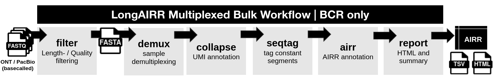

# Bulk Snakemake workflow

The bulk Snakemake workflow is designed for multiplexed Takara SMART-Seq Human
BCR libraries with UMIs. It runs:



The workflow starts from a basecalled FASTQ file. Basecalling is performed
separately on a GPU when required.

## Snakemake Workflow files

All runtime parameters are passed to LongAIRR using a `config.yaml`.
The repository provides:
- [`snakefile_takara`](https://github.com/AGImkeller/LongAIRR/blob/devel/longairr_example_workflow/snakemake/takara/snakefile_takara)
- [`config.yaml`](https://github.com/AGImkeller/LongAIRR/blob/devel/longairr_example_workflow/snakemake/takara/config.yaml)

Both are saved within:

```text
longairr_example_workflow/snakemake/takara/ 
├── snakefile_takara 
└── config.yaml
```

Copy both into a run-specific working directory:

```bash
mkdir -p /path/to/workflows/bulk_run/

cp longairr_example_workflow/snakemake/takara/snakefile_takara \
  /path/to/workflows/bulk_run/

cp longairr_example_workflow/snakemake/takara/config.yaml \
  /path/to/workflows/bulk_run/

cd /path/to/workflows/bulk_run/
```

## Required inputs

| Input | Configuration key |
| --- | --- |
| Basecalled ONT or PacBio HiFi FASTQ | `INPUT_DUPLEX_FASTQ` |
| UDI barcode FASTA | `DEMUX_UID_FASTA` |
| UMI anchor FASTA | `COLLAPSE_ANCHOR_FASTA` |
| Constant-region anchor FASTA | `SEQTAG_FASTA` |
| IgBLAST and IMGT reference parent | `DATABASES_PARENT` |
| Output directory | `OUTPUT` |

Example UDI, UMI and constant-region FASTA files are available under:

```text
longairr_example_workflow/example_inputs/required_anchors/bulk_takara/
```

## 1. Define the UDI-to-sample mapping

The UDI FASTA header is the sample identifier:

```fasta
>UID6
GACGAGAG
>UID20
AGACTTGG
```

List exactly the same identifiers in `config.yaml`:

```yaml
samples:
  - UID6
  - UID20
```

Only include UDI sequences used in the current run. Additional similar
barcodes can increase ambiguous or incorrect assignments.

## 2. Set the input, reference and output paths

```yaml
INPUT_DUPLEX_FASTQ: "/absolute/path/to/input.fastq"
DEMUX_UID_FASTA: "/absolute/path/to/UDI_barcodes.fasta"
COLLAPSE_ANCHOR_FASTA: "/absolute/path/to/UMI_anchor.fasta"
SEQTAG_FASTA: "/absolute/path/to/constant_igh_anchors.fasta"
DATABASES_PARENT: "/absolute/path/to/databases/"
OUTPUT: "/absolute/path/to/longairr_results/"

COPY_CONFIG: True
CONFIG_PATH: "/absolute/path/to/workflows/bulk_run/config.yaml"
```

Or set `COPY_CONFIG: FALSE` if you initially copied both the snakefile and the config.yaml.

Use absolute paths in `config.yaml`. Avoid `~` and relative paths. Directory
paths such as `DATABASES_PARENT` and `OUTPUT` should end in `/`.

The directory under `DATABASES_PARENT` must contain:

```text
databases/
├── igblast/
└── germlines/
    └── imgt/
        └── human/
            └── vdj/
```

## 3. Configure the receptor locus and sequence tagging

For immunoglobulin analysis:

```yaml
AIRR_LOCUS: "ig"
AIRR_PH: True
```

Set `AIRR_LOCUS: "tr"` for a compatible T-cell receptor library.

Constant-region tagging can be enabled or skipped:

```yaml
RUN_SEQTAG: True
```

When `RUN_SEQTAG` is `True`, passing sequences from `seqtag` are supplied to
`airr`. When it is `False`, the consensus FASTA is supplied directly.

## 4. Review the analysis parameters

Review at least:

| Step | Parameters |
| --- | --- |
| Read filtering | `FILTER_MIN_QUAL`, `FILTER_MINL`, `FILTER_MAXL` |
| UDI assignment | `DEMUX_WINDOW_LENGTH`, `DEMUX_MAX_ERROR` |
| UMI annotation | `COLLAPSE_WINDOW_LENGTH`, `COLLAPSE_ANCHOR_ERROR`, `COLLAPSE_LENGTH` |
| Consensus input | `COLLAPSE_MINL`, `COLLAPSE_MAXL`, `COLLAPSE_GROUP_FIELD` |
| Adaptive filtering | `COLLAPSE_AF`, `COLLAPSE_AF_MIN_N`, `COLLAPSE_AF_BIN`, `COLLAPSE_AF_MARGIN` |
| Alignment workload | `COLLAPSE_N_SUBSAMPLE`, `COLLAPSE_N_CHUNK`, `COLLAPSE_JOBS` |

For the supplied workflow, keep:

```yaml
COLLAPSE_DEMUX: True
COLLAPSE_LIBRARY: "bulk"
COLLAPSE_GROUP_FIELD: "UMI"
```

The values in the example configuration are workflow presets rather than
universal defaults.

## 5. Check and run the workflow

Activate LongAIRR and perform a dry run (if installed via GitHub its called `longairr`):

```bash
conda activate longairr

snakemake \
  --snakefile snakefile_takara \
  --cores 16 \
  --dry-run \
  --printshellcmds
```

Then start the workflow:

```bash
snakemake \
  --snakefile snakefile_takara \
  --cores 16 \
  --printshellcmds
```

Snakemake processes the sample-specific `collapse`, optional `seqtag` and
`airr` rules independently. All configured sample-level AIRR tables must exist
before `longairr report` is run.

## Workflow outputs

Run-wide filtering and demultiplexing are stored at the run root. Downstream
results are organized by UDI/sample identifier:

```text
longairr_results/
├── filter_qc/
├── sample_demux/
│   ├── UID6/
│   │   ├── split_UDI-UID6.fasta
│   │   ├── collapse/
│   │   ├── seqtag/
│   │   └── airr/
│   └── UID20/
│       ├── split_UDI-UID20.fasta
│       ├── collapse/
│       ├── seqtag/
│       └── airr/
├── snakemake_logs/
├── summary.tsv
├── longairr_report.html
└── config.yaml
```

If `RUN_SEQTAG` is `False`, the sample-level `seqtag/` directories are not
created. Individual rule logs are written to `snakemake_logs/`.

