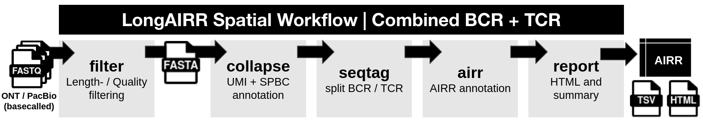

# Spatial Snakemake workflow

The spatial Snakemake workflow processes a basecalled Visium V1 or Visium HD
3′ AIRR library through:



It supports immunoglobulin, T-cell receptor or combined IG/TR analysis.
The workflow starts from a basecalled FASTQ file. Basecalling is performed
separately on a GPU when required.

## Snakemake Workflow files

All runtime parameters are passed to LongAIRR using a `config.yaml`.
The repository provides:
- [`snakefile_visium_hd`](https://github.com/AGImkeller/LongAIRR/blob/devel/longairr_example_workflow/snakemake/visium/snakefile_visium_hd)
- [`config.yaml`](https://github.com/AGImkeller/LongAIRR/blob/devel/longairr_example_workflow/snakemake/visium/config.yaml)

Both are saved within:

```text
longairr_example_workflow/snakemake/visium/ 
├── snakefile_visium_hd 
└── config.yaml
```

Copy both files into a sample-specific working directory:

```bash
mkdir -p /path/to/workflows/sample_name/

cp longairr_example_workflow/snakemake/visium/snakefile_visium_hd \
  /path/to/workflows/sample_name/

cp longairr_example_workflow/snakemake/visium/config.yaml \
  /path/to/workflows/sample_name/

cd /path/to/workflows/sample_name/
```

This keeps the repository examples unchanged and stores the configuration used
for each analysis separately.

## Required LongAIRR inputs

| Input | Configuration key |
| --- | --- |
| Basecalled ONT or PacBio HiFi FASTQ | `INPUT_FASTQ` |
| R1/UMI anchor FASTA | `COLLAPSE_ANCHOR_FASTA` |
| Visium V1 whitelist or Visium HD SQLite index | Library dependent |
| Constant-chain anchor FASTA | `SEQTAG_FASTA` |
| IgBLAST and IMGT reference parent | `DATABASES_PARENT` |
| Output directory | `OUTPUT` |

Example anchor files are available under:

```text
longairr_example_workflow/example_inputs/required_anchors/spatial_visium/
```

## 1. Select the spatial library

### Visium V1

```yaml
COLLAPSE_LIBRARY: "visium"
COLLAPSE_GROUP_FIELD: "SPBCUMI"
VISIUM_SPBCS_TXT: "/absolute/path/to/visium-v1_coordinates.txt"
```

The coordinate whitelist is obtained from the corresponding SpaceRanger
output. See [Spatial Barcode Whitelists - Visium V1](../in_depth/inputs_outputs/spbc_v1.md).

### Visium HD 3′

```yaml
COLLAPSE_LIBRARY: "visiumhd"
COLLAPSE_GROUP_FIELD: "UMISPBCID"
VISIUMHD_SPBC_INDEX: "/absolute/path/to/visium_whitelist.sqlite"
```

The SQLite index is created with [LongAIRR-Whitelist] from the matching spatial
AIRR SpaceRanger BAM. See [Spatial Barcode Whitelists - Visium HD 3'](../in_depth/inputs_outputs/spbc_hd3.md).

## 2. Set the input, reference and output paths

```yaml
INPUT_FASTQ: "/absolute/path/to/input.fastq"
COLLAPSE_ANCHOR_FASTA: "/absolute/path/to/r1_anchor.fasta"
SEQTAG_FASTA: "/absolute/path/to/constant_chain_anchors.fasta"
DATABASES_PARENT: "/absolute/path/to/databases/"
OUTPUT: "/absolute/path/to/longairr_results/"

COPY_CONFIG: True
CONFIG_PATH: "/absolute/path/to/workflows/sample_name/config.yaml"
```

Or set `COPY_CONFIG: FALSE` if you initially copied both the snakefile and the config.yaml.

Use absolute paths in `config.yaml`. Avoid `~` and relative paths. Directory
paths such as `DATABASES_PARENT` and `OUTPUT` should end in `/`.

The directory under `DATABASES_PARENT` must contain:

```text
databases/
├── igblast/
└── germlines/
    └── imgt/
        └── human/
            └── vdj/
```

## 3. Configure the receptor locus and sequence tagging

For a combined IG/TR library:

```yaml
SEQTAG_SPLIT: True
SEQTAG_SPLIT_REGEX: "Ig,TCR"

SEQTAG_regex:
  - "Ig"
  - "TCR"

locus_igblast:
  - "ig"
  - "tr"
```

The two lists are paired by position: `Ig` is passed to `ig-locus` annotation and
`TCR` to `tr-locus` annotation. 

**The identifiers in `SEQTAG_SPLIT_REGEX` must match header-characters in the constant-chain anchor FASTA.**

```fasta
>Ig | 1 | IGHA
GCATCCCCGACCAGC
>Ig | 2 | IGHA
AAGTCCGTGACATGC
>Ig | 3 | IGHG
CCACCAAGGGCCCAT
>Ig | 4 | IGHG
GGACTCTACTCCCTC
>Ig | 5 | IGHM
GGGAGTGCATCCGCC
...
>TCR | 16 | TRAC
ATTATTCCAGAAGAC
>TCR | 17 | TRBC
```

## 4. Review the analysis parameters

The example configuration contains workflow presets. Review at least:

| Step | Parameters |
| --- | --- |
| Read filtering | `FILTER_MIN_QUAL`, `FILTER_MIN_L`, `FILTER_MAX_L` |
| Barcode/UMI annotation | `COLLAPSE_WINDOW_LENGTH`, `COLLAPSE_ANCHOR_ERROR`, barcode reference |
| Consensus input | `COLLAPSE_MINL`, `COLLAPSE_MAXL`, `COLLAPSE_GROUP_FIELD` |
| Adaptive filtering | `COLLAPSE_AF`, `COLLAPSE_AF_MIN_N`, `COLLAPSE_AF_BIN`, `COLLAPSE_AF_MARGIN` |
| Alignment workload | `COLLAPSE_N_SUBSAMPLE`, `COLLAPSE_N_CHUNK`, `COLLAPSE_JOBS` |
| Locus separation | `SEQTAG_WINDOW_LENGTH`, `SEQTAG_ANCHOR_ERROR`, split settings |

Values in the example configuration are not necessarily the LongAIRR command
defaults. Keep the final configuration together with the analysis results.

## 5. Check and run the workflow

Activate LongAIRR environment (if installed via GitHub its called `longairr`):

```bash
conda activate longairr
```

First perform a dry run:

```bash
snakemake \
  --snakefile snakefile_visium_hd \
  --cores 12 \
  --dry-run \
  --printshellcmds
```

Then start the workflow:

```bash
snakemake \
  --snakefile snakefile_visium_hd \
  --cores 12 \
  --printshellcmds
```

`--cores` limits the total resources available to Snakemake.
`COLLAPSE_JOBS` controls the parallel alignment jobs passed to
`longairr collapse`.

## Workflow outputs

The workflow waits for all configured IG and/or TR AIRR outputs before
generating the final report:

```text
longairr_results/
├── filter_qc/
├── collapse/
├── seqtag/
│   ├── Ig/
│   └── TCR/
├── airr/
│   ├── ig_p_parse-select.tsv
│   └── tr_p_parse-select.tsv
├── snakemake_logs/
├── summary.tsv
├── longairr_report.html
└── config.yaml
```

Only the loci requested in `config.yaml` are generated. Individual rule logs
are written to `snakemake_logs/`.

## Example data

See the [synthetic Visium V1 demo dataset](https://github.com/AGImkeller/LongAIRR/tree/main/longairr_example_workflow/example_inputs) provided
in the repository as possible test input and the additional files needed to run it.
