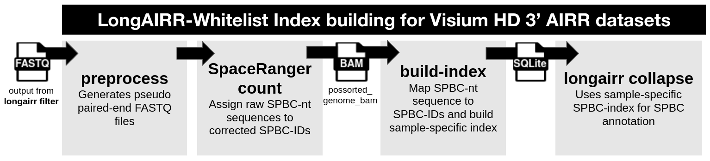

# Visium HD 3′ spatial barcode index

For spatial datasets, `longairr collapse` determines the molecular and spatial
identity of every read by annotating UMI and Spatial Barcode Sequences.

To omit introducing invalid spatial locations, which would break downstream
analysis due to missing coordinates, LongAIRR utilizes a whitelist approach, where
the spatial identity of every read gets validated against a list of known spatial barcode sequences.

LongAIRR uses a sample-specific spatial barcode index to connect raw barcode
sequences observed in Visium HD 3′ AIRR reads with their corrected spatial
identifiers and tissue coordinates. The index is generated with the companion
tool [LongAIRR-Whitelist](https://github.com/AGImkeller/LongAIRR_whitelist).

Unlike the predefined coordinate whitelist used for Visium V1, the Visium HD
index must be generated from the matching dataset. It should not be reused
between samples or Space Ranger runs.

Visit the corresponding [GitHub repository](https://github.com/AGImkeller/LongAIRR_whitelist) for installation guidelines.

Jump to:
[How to use LongAIRR-Whitelist](#required-inputs) ·
[LongAIRR-Whitelist output](#index-outputs) ·
[Troubleshooting bam-tags](#select-the-corrected-spatial-barcode-tag) 

## How LongAIRR-Whitelist works

LongAIRR-Whitelist connects spatial barcode sequences in the original long
reads with the spatial assignments made by Space Ranger. The complete workflow
has three stages:





1. **Preprocess the long reads:** ONT reads are converted into
   Space Ranger-compatible pseudo paired-end FASTQ files.
2. **Run Space Ranger:** Space Ranger processes the pseudo short reads and
   assigns raw barcode sequences to corrected Visium HD spatial identifiers.
3. **Build the index:** LongAIRR-Whitelist extracts the barcode assignments
   from the Space Ranger BAM and writes a sample-specific SQLite database.

During index construction, LongAIRR-Whitelist uses a sequence-centric mapping:

```text
raw observed spatial barcode sequence  →  corrected Visium HD spatial identifier
```

Raw barcode sequences assigned to exactly one corrected spatial identifier are
retained in the LongAIRR runtime lookup. Raw sequences associated with multiple
spatial identifiers are reported as ambiguous and excluded from the lookup.
This prevents uncertain mappings from introducing incorrect tissue positions.

## Required inputs

The required inputs depend on whether the complete workflow or only the final
index-building step is performed.

| Stage | Main input |
| --- | --- |
| Preprocessing | Basecalled and filtered ONT spatial AIRR reads in FASTQ format |
| Space Ranger | Preprocessed pseudo paired-end FASTQs and the standard dataset-specific Space Ranger inputs |
| Index construction | `outs/possorted_genome_bam.bam` from the matching Space Ranger run |

The first polished LongAIRR-Whitelist workflow supports ONT preprocessing. The
`build-index` step is platform-independent once a suitable Space Ranger BAM is
available.

## 1. Preprocess ONT reads

Run preprocessing on the filtered long-read FASTQ file:

```bash
longairrwhitelist preprocess \
  --platform ont \
  --input /path/to/longairr_filtered.fastq \
  --out /local/scratch/percula_fastq/sample1 \
  --sample sample1
```

The ONT preprocessing workflow uses `fastcat` and `percula` to generate
Space Ranger-compatible pseudo paired-end FASTQ files. It also creates a
manifest and an editable Space Ranger command template for the dataset.

## 2. Run Space Ranger

Space Ranger is an external dependency and is not installed by
LongAIRR-Whitelist. Review the generated template and provide the usual
dataset-specific inputs, including the reference, slide, capture area and
image.

An example command has the following structure:

```bash
spaceranger count \
  --id=sample1_spaceranger \
  --transcriptome=/path/to/refdata-gex-GRCh38-2020-A \
  --fastqs=/local/scratch/percula_fastq/sample1 \
  --sample=<FASTQ_SAMPLE_PREFIX> \
  --slide=<VISIUM_HD_SLIDE_SERIAL> \
  --area=<CAPTURE_AREA> \
  --cytaimage=/path/to/cytassist_image.tiff \
  --localcores=8 \
  --localmem=64 \
  --create-bam=true
```

The value supplied to `--sample` must match the sample prefix of the generated
FASTQ files. Most importantly, keep `--create-bam=true`: index construction
requires the following output file:

```text
<spaceranger_output>/<id>/outs/possorted_genome_bam.bam
```

!!! important "Use local storage for active processing"
    Run Space Ranger and SQLite index construction on local disk or cluster
    scratch. CIFS/SMB and other network-mounted storage can cause Space Ranger
    symlink problems or SQLite locking errors. Completed outputs can be copied
    to network storage afterwards.

## 3. Build the spatial barcode index

Build the SQLite index from the Space Ranger BAM:

```bash
longairrwhitelist build-index \
  --bam /path/to/outs/possorted_genome_bam.bam \
  --out sample.visiumhd.spbc.sqlite \
  --out-prefix sample.visiumhd.spbc \
  --threads 8 \
  --force
```

For a quick functional test, limit processing to the first 100,000 BAM
records:

```bash
longairrwhitelist build-index \
  --bam /path/to/outs/possorted_genome_bam.bam \
  --out sample.test.visiumhd.spbc.sqlite \
  --out-prefix sample.test.visiumhd.spbc \
  --max-reads 100000 \
  --force
```

`--max-reads` is intended only for testing. Omit it or use `--max-reads 0` when
building the final index.

### Select the corrected spatial-barcode tag

LongAIRR-Whitelist reads the raw spatial barcode sequence from the `CR` BAM tag
by default. Depending on the Space Ranger version and run, the corrected
Visium HD spatial identifier may be stored in either `CB` or `sb`.

Inspect a few records before building the full index:

```bash
samtools view /path/to/outs/possorted_genome_bam.bam \
  | head -n 3 \
  | tr '\t' '\n' \
  | grep -E '^(CR|CB|sb):'
```

If `CB` contains identifiers such as `s_002um_02068_00347-1`, the default
setting is appropriate. If the spatial identifier is stored in `sb`, specify:

```bash
longairrwhitelist build-index \
  --bam /path/to/outs/possorted_genome_bam.bam \
  --out sample.visiumhd.spbc.sqlite \
  --out-prefix sample.visiumhd.spbc \
  --cb-tag sb \
  --threads 8 \
  --force
```

!!! warning
    An incorrect corrected-barcode tag can produce an index with no runtime
    lookup entries. If `spbc_lookup` is empty, inspect the BAM tags first and
    repeat index construction with the appropriate `--cb-tag` value.

## Index outputs

The main output is the SQLite database supplied to LongAIRR. It contains four
tables:

| Table | Content |
| --- | --- |
| `spbc_lookup` | Unique raw barcode sequence to corrected spatial identifier mappings used by LongAIRR |
| `observed_pairs` | All raw-to-corrected barcode evidence observed in the Space Ranger BAM |
| `ambiguous_raw_spbc` | Raw sequences mapping to multiple corrected identifiers and excluded from `spbc_lookup` |
| `metadata` | Package version, run settings and summary counts |

LongAIRR-Whitelist additionally writes:

```text
sample.visiumhd.spbc.summary.json
sample.visiumhd.spbc.qc.tsv
```

Compressed TSV copies of the SQLite tables can be generated with
`--export-tsv` for manual inspection. The SQLite database remains the runtime
input used by LongAIRR.


## Use the index with LongAIRR

For a manual Visium HD run, provide the database to `longairr collapse` and
group consensus sequences using the corrected spatial identifier:

```bash
longairr collapse \
  --library visiumhd \
  --hd-spbc-index /path/to/sample.visiumhd.spbc.sqlite \
  --group-field UMISPBCID \
  /path/to/r1_anchor.fasta \
  /path/to/filtered_reads.fasta \
  /path/to/longairr_output
```

For the spatial Snakemake workflow, set:

```yaml
COLLAPSE_LIBRARY: "visiumhd"
COLLAPSE_GROUP_FIELD: "UMISPBCID"
VISIUMHD_SPBC_INDEX: "/absolute/path/to/sample.visiumhd.spbc.sqlite"
```

See [LongAIRR collapse](../longairr_modules/collapse.md) for all consensus-generation
options and the [spatial Snakemake workflow](../../example_workflows/snakemake_spatial.md)
for the complete LongAIRR workflow.

## Installation and complete reference

LongAIRR-Whitelist is installed separately from LongAIRR. Installation guidelines
are documented in the [LongAIRR-Whitelist GitHub repository](https://github.com/AGImkeller/LongAIRR_whitelist).
