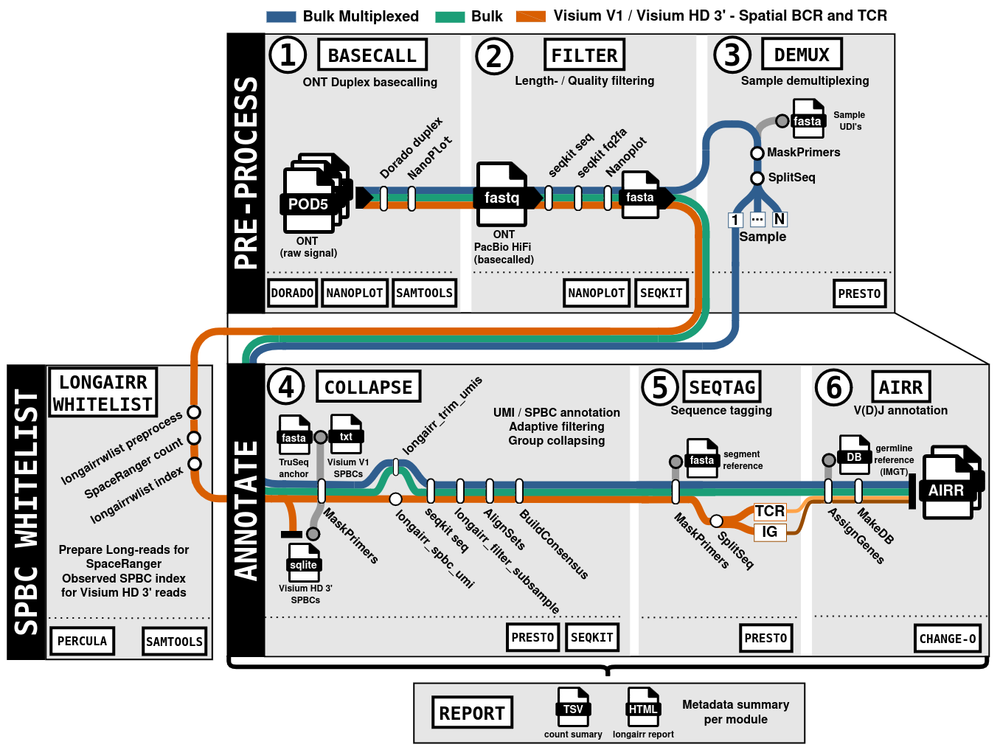

# LongAIRR modules

LongAIRR contains seven modules. They can be chained into a complete workflow
or run independently from an appropriate intermediate file. Our companion package
[LongAIRR-Whitelist](https://github.com/AGImkeller/LongAIRR_whitelist) can be used
to build a spatial barcode whitelist for Visium HD 3' datasets.

|  | Module | Function |
| --- | --- | --- |
| longairr | [`basecall`](basecall.md) | Basecall ONT POD5 data and create raw-read quality control |
|  | [`filter`](filter.md) | Apply read-quality and length filters |
|  | [`demux`](demux.md) | Assign multiplexed bulk reads to samples using UDIs |
|  | [`collapse`](collapse.md) | Annotate UMIs and spatial barcodes, group reads and generate consensus sequences |
|  | [`seqtag`](seqtag.md) | Assign constant-region or receptor-family tags using sequence anchors |
|  | [`airr`](airr.md) | Perform IG or TR V(D)J annotation and generate AIRR tables |
|  | [`report`](report.md) | Validate module metadata and generate the run summary and HTML report |

Not every workflow uses every module. Spatial workflows omit `demux`, while
already-basecalled data omit `basecall`. Sequence tagging can be optional,
depending on the library and required output.

!!! info "See also"
    LongAIRR uses a sample-specific spatial barcode index to connect raw barcode
    sequences observed in Visium HD 3′ AIRR reads with their corrected spatial
    identifiers and tissue coordinates. The index is generated with the companion
    tool [LongAIRR-Whitelist](https://github.com/AGImkeller/LongAIRR_whitelist).
