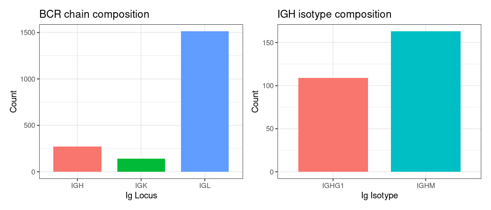
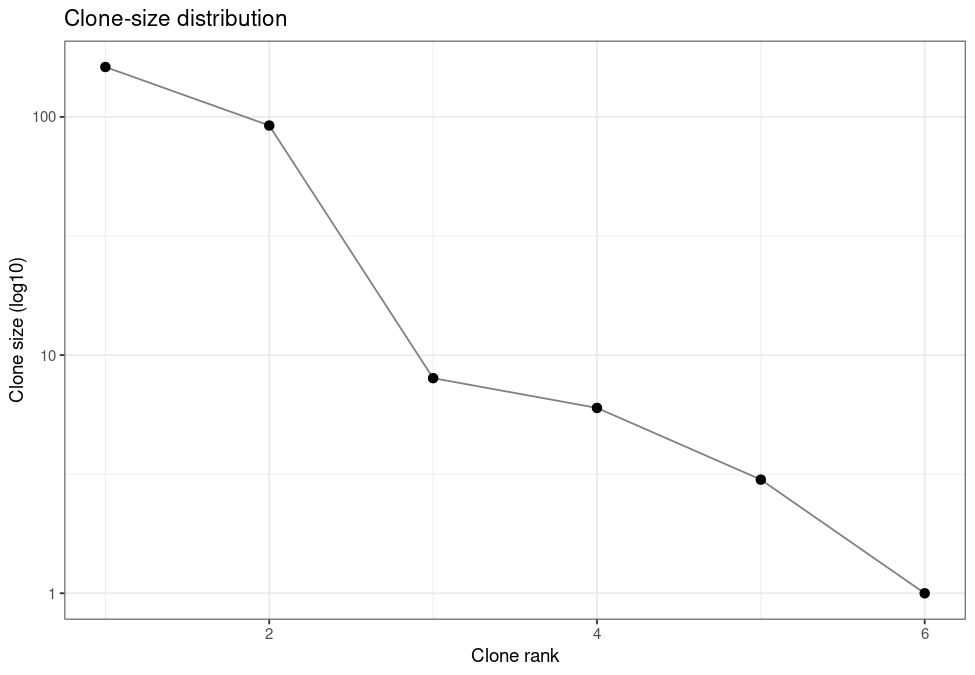
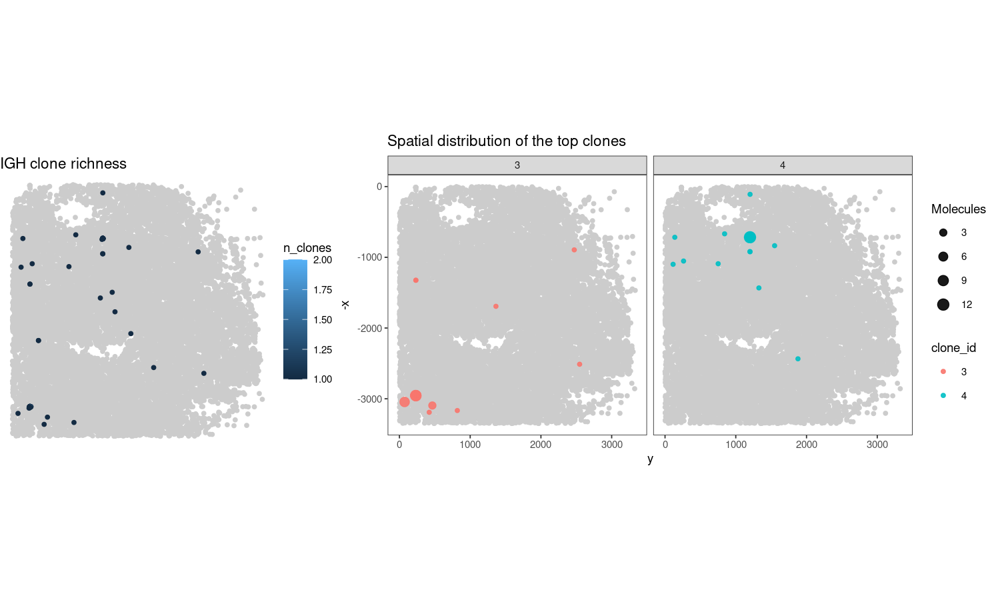

**Part 1**: Start spatial AIRR analysis with LongAIRR output
================

This vignette provides a starting point for analysing spatial AIRR data
generated with LongAIRR. Using a **Visium HD 3’** dataset, we
demonstrate how to:

- load and inspect a LongAIRR AIRR rearrangement table
- summarize the receptor repertoire and assign IGH clones using SCOPer
- visualize clone distributions using LongAIRR spatial coordinates
- combine LongAIRR output with matching Space Ranger results and
- import the annotated AIRR table into scRepertoire

This is **Part 1** of the vignette. Refer to the [**Vignette 1 Overview**](./vignette1_overview.md)
or move to [**Part 2**](./longairr_vignette1_part2.md) and [**Part 3**](./longairr_vignette1_part3.md) directly.

**Part 2** and **Part 3** will reuse the main object generated in this
chapter.

---

``` r
library(dplyr)
library(ggplot2)
library(patchwork)
library(purrr)
library(readr)
library(scoper)
library(scRepertoire)
library(shazam)
library(stringr)
library(tibble)
library(cowplot)
```

------------------------------------------------------------------------

This first part requires only the AIRR rearrangement table produced by
LongAIRR. No Space Ranger files or gene-expression data are used.

## Load and inspect the LongAIRR output

Refer to the (spatial) AIRR chapter for more information about the
expected columns in spatial AIRR tables.

``` r
SAMPLE_LABEL <- "spAIRR_HD"

AIRR_FILE <-file.path("/path/to/longairr_results/runXYZ/airr/ig_p_parse-select.tsv")

airr_raw <- readr::read_tsv(AIRR_FILE, show_col_types = FALSE, progress = FALSE)
```

``` r
#perform downstream filters
airr_filtered <- airr_raw %>% 
                filter(!is.na(c_call) & str_sub(c_call, 1, 3) == locus & !grepl("TTTTTTTTTTT", umi) & !grepl("N", junction)) %>%
                filter(consensus_count > 1)

# retrieve sub-isotype from c_call annotation
airr <- airr_filtered %>%
  mutate(isotype_sub = stringr::str_extract(as.character(c_call), "IGH[A-Z][A-Z0-9]*"))

table(airr$isotype_sub)
```

    ## 
    ## IGHG1  IGHM 
    ##   109   163

The following summaries provide a quick overview of the selected input
and identify fields that would prevent clone assignment or spatial
visualization.

``` r
dataset_summary <- tibble::tribble(
  ~metric, ~value,
  "Productive rows", sum(airr$productive),
  "Productive IGH rows", sum(airr$productive & airr$locus == "IGH", na.rm = TRUE),
  "Spatial positions [spbcid]", dplyr::n_distinct(airr$spbcid, na.rm = TRUE),
  "Molecule groups [group]", dplyr::n_distinct(airr$group, na.rm = TRUE))

dataset_summary
```

<div class="kable-table">

<table>

<thead>

<tr>

<th style="text-align:left;">

metric
</th>

<th style="text-align:right;">

value
</th>

</tr>

</thead>

<tbody>

<tr>

<td style="text-align:left;">

Productive rows
</td>

<td style="text-align:right;">

1926
</td>

</tr>

<tr>

<td style="text-align:left;">

Productive IGH rows
</td>

<td style="text-align:right;">

272
</td>

</tr>

<tr>

<td style="text-align:left;">

Spatial positions \[spbcid\]
</td>

<td style="text-align:right;">

470
</td>

</tr>

<tr>

<td style="text-align:left;">

Molecule groups \[group\]
</td>

<td style="text-align:right;">

1926
</td>

</tr>

</tbody>

</table>

</div>


------------------------------------------------------------------------

## Repertoire overview

Before assigning clones, simple summaries can be generated directly from
the AIRR table. Here, each row represents one reconstructed LongAIRR
molecule.

``` r
locus_counts <- airr %>%
  count(locus, name = "n_chains")

isotype_counts <- airr %>%
  filter(locus == "IGH") %>%
  count(isotype_sub, name = "n_chains") %>%
  arrange(desc(n_chains))
```

Complete figure:

``` r
p_locus <- ggplot(locus_counts, aes(x = locus, y = n_chains, fill = locus)) +
  geom_col(width = 0.75, show.legend = FALSE) +
  labs(title = "BCR chain composition", x = "Ig Locus", y = "Count") +
  theme_bw(base_size = 9)

p_isotype <- ggplot(isotype_counts, aes(x = isotype_sub, y = n_chains, fill = isotype_sub)) +
  geom_col(width = 0.75, show.legend = FALSE) +
  labs(title = "IGH isotype composition", x = "Ig Isotype", y = "Count") +
  theme_bw(base_size = 9)

p_repertoire_overview <- p_locus + p_isotype
p_repertoire_overview
```

<!-- -->


------------------------------------------------------------------------

## Assign IGH clones with SCOPer

SCOPer clone assignment in this vignette focuses on **productive IGH
sequences**. Spatial coordinates are retained as metadata but are not
used to define the clones.

SCOPer applies hierarchical clustering using the selected threshold and
adds a new `clone_id` column. We choose `0.1` here. Clone identifiers
are specific to the selected dataset and clone-assignment parameters.

We further generate a figure giving an overview about the clone-size
distribution.

``` r
airr_igh <- airr %>%
  filter(locus == "IGH")

scoper_result <- scoper::hierarchicalClones(db = airr_igh, threshold = 0.1, summarize_clones = TRUE)
igh_clones <- as.data.frame(scoper_result)

# inspect clone df
igh_clones %>%
  select(sequence_id, v_call, j_call, isotype_sub, junction, clone_id, spbcid, x, y) %>%
  head(8)
```

<div class="kable-table">

<table>

<thead>

<tr>

<th style="text-align:left;">

sequence_id
</th>

<th style="text-align:left;">

v_call
</th>

<th style="text-align:left;">

j_call
</th>

<th style="text-align:left;">

isotype_sub
</th>

<th style="text-align:left;">

junction
</th>

<th style="text-align:left;">

clone_id
</th>

<th style="text-align:left;">

spbcid
</th>

<th style="text-align:right;">

x
</th>

<th style="text-align:right;">

y
</th>

</tr>

</thead>

<tbody>

<tr>

<td style="text-align:left;">

seq827085
</td>

<td style="text-align:left;">

IGHV3-23*01,IGHV3-23D*01
</td>

<td style="text-align:left;">

IGHJ4\*02
</td>

<td style="text-align:left;">

IGHG1
</td>

<td style="text-align:left;">

TGTGCGAAAGTTTACTACGGTGGTAAGGAAATTGACTACTGG
</td>

<td style="text-align:left;">

1
</td>

<td style="text-align:left;">

s_002um_01509_01169-1
</td>

<td style="text-align:right;">

1509
</td>

<td style="text-align:right;">

1169
</td>

</tr>

<tr>

<td style="text-align:left;">

seq848742
</td>

<td style="text-align:left;">

IGHV3-23*01,IGHV3-23D*01
</td>

<td style="text-align:left;">

IGHJ4\*02
</td>

<td style="text-align:left;">

IGHG1
</td>

<td style="text-align:left;">

TGTGCGAAAGTTTACTACGGTGGTAAGGAAATTGACTACTGG
</td>

<td style="text-align:left;">

1
</td>

<td style="text-align:left;">

s_002um_01983_01575-1
</td>

<td style="text-align:right;">

1983
</td>

<td style="text-align:right;">

1575
</td>

</tr>

<tr>

<td style="text-align:left;">

seq849771
</td>

<td style="text-align:left;">

IGHV3-23*01,IGHV3-23D*01
</td>

<td style="text-align:left;">

IGHJ4\*02
</td>

<td style="text-align:left;">

IGHG1
</td>

<td style="text-align:left;">

TGTGCGAAAGTTTACTACGGTGGTAAGGAAATTGACTACTGG
</td>

<td style="text-align:left;">

1
</td>

<td style="text-align:left;">

s_002um_01983_01575-1
</td>

<td style="text-align:right;">

1983
</td>

<td style="text-align:right;">

1575
</td>

</tr>

<tr>

<td style="text-align:left;">

seq769398
</td>

<td style="text-align:left;">

IGHV3-30*04,IGHV3-30-3*03
</td>

<td style="text-align:left;">

IGHJ4\*02
</td>

<td style="text-align:left;">

IGHM
</td>

<td style="text-align:left;">

TGTGCGAGAGGCCGTGGCTACTGCCTTGACTACTGG
</td>

<td style="text-align:left;">

2
</td>

<td style="text-align:left;">

s_002um_02959_00234-1
</td>

<td style="text-align:right;">

2959
</td>

<td style="text-align:right;">

234
</td>

</tr>

<tr>

<td style="text-align:left;">

seq758830
</td>

<td style="text-align:left;">

IGHV3-30*04,IGHV3-30-3*03
</td>

<td style="text-align:left;">

IGHJ4\*02
</td>

<td style="text-align:left;">

IGHM
</td>

<td style="text-align:left;">

TGTGCGAGAGGCCGTGGGAGCTACTGCCTTGACTACTGG
</td>

<td style="text-align:left;">

3
</td>

<td style="text-align:left;">

s_002um_02952_00233-1
</td>

<td style="text-align:right;">

2952
</td>

<td style="text-align:right;">

233
</td>

</tr>

<tr>

<td style="text-align:left;">

seq763377
</td>

<td style="text-align:left;">

IGHV3-30*04,IGHV3-30-3*03
</td>

<td style="text-align:left;">

IGHJ4\*02
</td>

<td style="text-align:left;">

IGHM
</td>

<td style="text-align:left;">

TGTGCGAGAGGCCGTGGGAGCTACTGCCTTGACTACTGG
</td>

<td style="text-align:left;">

3
</td>

<td style="text-align:left;">

s_002um_01325_00232-1
</td>

<td style="text-align:right;">

1325
</td>

<td style="text-align:right;">

232
</td>

</tr>

<tr>

<td style="text-align:left;">

seq765013
</td>

<td style="text-align:left;">

IGHV3-30*04,IGHV3-30*19,IGHV3-30-3\*03
</td>

<td style="text-align:left;">

IGHJ4\*02
</td>

<td style="text-align:left;">

IGHM
</td>

<td style="text-align:left;">

TGTGCGAGAGGCCGTGGGAGCTACTGCCTTGACTACTGG
</td>

<td style="text-align:left;">

3
</td>

<td style="text-align:left;">

s_002um_02952_00230-1
</td>

<td style="text-align:right;">

2952
</td>

<td style="text-align:right;">

230
</td>

</tr>

<tr>

<td style="text-align:left;">

seq765097
</td>

<td style="text-align:left;">

IGHV3-30*04,IGHV3-30-3*03
</td>

<td style="text-align:left;">

IGHJ4\*02
</td>

<td style="text-align:left;">

IGHM
</td>

<td style="text-align:left;">

TGTGCGAGAGGCCGTGGGAGCTACTGCCTTGACTACTGG
</td>

<td style="text-align:left;">

3
</td>

<td style="text-align:left;">

s_002um_02953_00230-1
</td>

<td style="text-align:right;">

2953
</td>

<td style="text-align:right;">

230
</td>

</tr>

</tbody>

</table>

</div>

``` r
#rank clones by size
clone_summary <- igh_clones %>%
  group_by(clone_id) %>%
  summarise(n_molecules = n(),
            n_spbcs = n_distinct(spbcid),
            sum_consensus_count = sum(consensus_count, na.rm = TRUE), .groups = "drop") %>%
  arrange(desc(n_molecules), clone_id) %>%
  mutate(clone_rank = row_number())

#inspect clone sizes
clone_summary %>%
  head(10)
```

<div class="kable-table">

<table>

<thead>

<tr>

<th style="text-align:left;">

clone_id
</th>

<th style="text-align:right;">

n_molecules
</th>

<th style="text-align:right;">

n_spbcs
</th>

<th style="text-align:right;">

sum_consensus_count
</th>

<th style="text-align:right;">

clone_rank
</th>

</tr>

</thead>

<tbody>

<tr>

<td style="text-align:left;">

3
</td>

<td style="text-align:right;">

162
</td>

<td style="text-align:right;">

57
</td>

<td style="text-align:right;">

14147
</td>

<td style="text-align:right;">

1
</td>

</tr>

<tr>

<td style="text-align:left;">

4
</td>

<td style="text-align:right;">

92
</td>

<td style="text-align:right;">

36
</td>

<td style="text-align:right;">

10884
</td>

<td style="text-align:right;">

2
</td>

</tr>

<tr>

<td style="text-align:left;">

6
</td>

<td style="text-align:right;">

8
</td>

<td style="text-align:right;">

2
</td>

<td style="text-align:right;">

772
</td>

<td style="text-align:right;">

3
</td>

</tr>

<tr>

<td style="text-align:left;">

5
</td>

<td style="text-align:right;">

6
</td>

<td style="text-align:right;">

2
</td>

<td style="text-align:right;">

712
</td>

<td style="text-align:right;">

4
</td>

</tr>

<tr>

<td style="text-align:left;">

1
</td>

<td style="text-align:right;">

3
</td>

<td style="text-align:right;">

2
</td>

<td style="text-align:right;">

108
</td>

<td style="text-align:right;">

5
</td>

</tr>

<tr>

<td style="text-align:left;">

2
</td>

<td style="text-align:right;">

1
</td>

<td style="text-align:right;">

1
</td>

<td style="text-align:right;">

2
</td>

<td style="text-align:right;">

6
</td>

</tr>

</tbody>

</table>

</div>

``` r
p_clone_rank <- ggplot(clone_summary,
  aes(x = clone_rank, y = n_molecules)) +
  geom_line(linewidth = 0.4, color = "grey50") +
  geom_point(size = 1.8) +
  scale_y_log10() +
  labs(title = "Clone-size distribution", x = "Clone rank", y = "Clone size (log10)") +
  theme_bw(base_size = 9)

p_clone_rank
```

<!-- -->

------------------------------------------------------------------------


## Spatial distribution of annotated IgH clones

To explore the clone distribution in their tissue context, we generate a
figure showcasing clone richness per spatial position and the
distribution of the most expanded clone

For the background layer we take the raw, unfiltered AIRR input to
resemble the overall tissue structure.

``` r
#background layer of all captured spots
spatial_background <- airr_raw %>%
  distinct(spbcid, x, y)
```

Clonal richness:

``` r
spatial_clone_summary <- igh_clones %>%
  group_by(spbcid, x, y) %>%
  summarise(n_clones = n_distinct(clone_id),
            n_molecules = n(), .groups = "drop")

p_richness <- ggplot() +
  geom_point(data = spatial_background, aes(x = y, y = -x), color = "grey80", size = 1.2) +     #background layer
  geom_point(data = spatial_clone_summary, aes(x = y, y = -x, color = n_clones), size = 1.2) +
  coord_equal() +
  labs(title = "IGH clone richness") +
  theme_void(base_size = 9)
```

Top clones:

``` r
top_clone_ids <- clone_summary %>%
  slice_head(n = 2) %>%
  pull(clone_id)

top_clone_spatial <- igh_clones %>%
  filter(clone_id %in% top_clone_ids) %>%
  count(clone_id, spbcid, x, y, name = "n_molecules")
```

``` r
p_top_clones <- ggplot() +
  geom_point(data = spatial_background, aes(x = y, y = -x), color = "grey80", size = 1.2) +
  geom_point(data = top_clone_spatial, aes(x = y, y = -x, color = clone_id, size = n_molecules), alpha = 0.9) +
  facet_wrap(~clone_id) +
  scale_size_continuous(name = "Molecules", range = c(1.2, 3.6)) +
  coord_equal() +
  labs(title = paste0("Spatial distribution of the top clones"),) +
  theme_bw(base_size = 9) +
  theme(panel.grid.minor = element_blank(), panel.grid.major = element_blank())
```

Complete figure:

``` r
spatial_overview_complete <- plot_grid(p_richness, p_top_clones, ncol=2, rel_widths = c(0.5, 1))
spatial_overview_complete
```

<!-- -->

Since the native spatial bin-size for Visium HD 3’ datasets annotated
with LongAIRR is 2 µm, accumulation of multiple clones within the same
bin is rare.

We will explore how to assign the 16 µm spatial bin and segmented cell
annotation provided by SpaceRanger in **Part 2**.

------------------------------------------------------------------------

[**Part 2**](./longairr_vignette1_part2.md) shows **how to combine spatial**
**AIRR output from LongAIRR** **with matching SpaceRanger output**.
Specifically, how to aggregate the **native 2 µm resolution** from Visium
HD 3’ datasets to the corresponding **16 µm** or 
**segmented cell bin-annotation** with ways of visualizing the 
spatial distribution using the **H&E tissue images**.

------------------------------------------------------------------------

# Additional resources

- [LongAIRR GitHub repository](https://github.com/AGImkeller/LongAIRR)  
  Source code, installation instructions, example workflows and issue
  tracker.

- [LongAIRR-Whitelist GitHub
  repository](https://github.com/AGImkeller/LongAIRR_whitelist)  
  Companion workflow for generating sample-specific Visium HD 3′
  spatial-barcode indices.  
  *This link will become available once the repository is public.*

- [AIRR Community Data
  Standards](https://docs.airr-community.org/en/latest/datarep/overview.html)  
  Standards for representing and exchanging adaptive immune receptor
  repertoire data.

- [AIRR Rearrangement
  schema](https://docs.airr-community.org/en/latest/datarep/rearrangements.html)  
  Definitions of the standardized fields used in AIRR rearrangement
  tables.

- [Immcantation
  documentation](https://immcantation.readthedocs.io/en/stable/)  
  Framework for AIRR-seq processing and downstream repertoire analysis.

- [SCOPer documentation](https://scoper.readthedocs.io/)  
  Methods for assigning B-cell clonal relationships from AIRR-formatted
  data.

- [scRepertoire on
  Bioconductor](https://bioconductor.org/packages/scRepertoire/)  
  Installation, reference manual and vignettes for single-cell
  immune-receptor analysis.

- [scRepertoire GitHub
  repository](https://github.com/BorchLab/scRepertoire)  
  Source code, examples and issue tracker.

------------------------------------------------------------------------

# Session Information

``` r
sessionInfo()
```

    ## R version 4.6.0 (2026-04-24)
    ## Platform: x86_64-pc-linux-gnu
    ## Running under: Ubuntu 22.04.5 LTS
    ## 
    ## Matrix products: default
    ## BLAS:   /usr/lib/x86_64-linux-gnu/blas/libblas.so.3.10.0 
    ## LAPACK: /usr/lib/x86_64-linux-gnu/lapack/liblapack.so.3.10.0  LAPACK version 3.10.0
    ## 
    ## locale:
    ##  [1] LC_CTYPE=en_US.UTF-8       LC_NUMERIC=C              
    ##  [3] LC_TIME=en_US.UTF-8        LC_COLLATE=en_US.UTF-8    
    ##  [5] LC_MONETARY=en_US.UTF-8    LC_MESSAGES=en_US.UTF-8   
    ##  [7] LC_PAPER=en_US.UTF-8       LC_NAME=C                 
    ##  [9] LC_ADDRESS=C               LC_TELEPHONE=C            
    ## [11] LC_MEASUREMENT=en_US.UTF-8 LC_IDENTIFICATION=C       
    ## 
    ## time zone: Etc/UTC
    ## tzcode source: system (glibc)
    ## 
    ## attached base packages:
    ## [1] stats     graphics  grDevices utils     datasets  methods   base     
    ## 
    ## other attached packages:
    ##  [1] cowplot_1.2.0      tibble_3.3.1       stringr_1.6.0      shazam_1.3.2      
    ##  [5] scRepertoire_2.8.0 scoper_1.5.0       readr_2.2.0        purrr_1.2.2       
    ##  [9] patchwork_1.3.2    ggplot2_4.0.3      dplyr_1.2.1       
    ## 
    ## loaded via a namespace (and not attached):
    ##   [1] RColorBrewer_1.1-3          ggdendro_0.2.0             
    ##   [3] rstudioapi_0.18.0           jsonlite_2.0.0             
    ##   [5] magrittr_2.0.5              farver_2.1.2               
    ##   [7] iNEXT_3.0.2                 rmarkdown_2.31             
    ##   [9] vctrs_0.7.3                 memoise_2.0.1              
    ##  [11] Rsamtools_2.28.0            airr_1.6.1                 
    ##  [13] htmltools_0.5.9             S4Arrays_1.12.0            
    ##  [15] progress_1.2.3              SparseArray_1.12.2         
    ##  [17] parallelly_1.47.0           evmix_2.12                 
    ##  [19] KernSmooth_2.23-26          plyr_1.8.9                 
    ##  [21] cachem_1.1.0                GenomicAlignments_1.48.0   
    ##  [23] igraph_2.3.1                lifecycle_1.0.5            
    ##  [25] iterators_1.0.14            pkgconfig_2.0.3            
    ##  [27] Matrix_1.7-5                R6_2.6.1                   
    ##  [29] fastmap_1.2.0               MatrixGenerics_1.24.0      
    ##  [31] future_1.70.0               digest_0.6.39              
    ##  [33] immApex_1.6.0               S4Vectors_0.50.0           
    ##  [35] GenomicRanges_1.64.0        labeling_0.4.3             
    ##  [37] progressr_0.19.0            alakazam_1.4.3             
    ##  [39] polyclip_1.10-7             abind_1.4-8                
    ##  [41] compiler_4.6.0              bit64_4.8.0                
    ##  [43] withr_3.0.2                 doParallel_1.0.17          
    ##  [45] gsl_2.1-9                   S7_0.2.2                   
    ##  [47] BiocParallel_1.46.0         viridis_0.6.5              
    ##  [49] ggforce_0.5.0               MASS_7.3-65                
    ##  [51] quantreg_6.1                DelayedArray_0.38.1        
    ##  [53] rjson_0.2.23                tools_4.6.0                
    ##  [55] otel_0.2.0                  ape_5.8-1                  
    ##  [57] future.apply_1.20.2         glue_1.8.1                 
    ##  [59] nlme_3.1-169                grid_4.6.0                 
    ##  [61] reshape2_1.4.5              ade4_1.7-24                
    ##  [63] generics_0.1.4              seqinr_4.2-44              
    ##  [65] gtable_0.3.6                tzdb_0.5.0                 
    ##  [67] tidyr_1.3.2                 data.table_1.18.4          
    ##  [69] hms_1.1.4                   tidygraph_1.3.1            
    ##  [71] sp_2.2-1                    XVector_0.52.0             
    ##  [73] BiocGenerics_0.58.0         ggrepel_0.9.8              
    ##  [75] foreach_1.5.2               pillar_1.11.1              
    ##  [77] spam_2.11-3                 vroom_1.7.1                
    ##  [79] splines_4.6.0               tweenr_2.0.3               
    ##  [81] lattice_0.22-9              bit_4.6.0                  
    ##  [83] survival_3.8-6              SparseM_1.84-2             
    ##  [85] tidyselect_1.2.1            SingleCellExperiment_1.34.0
    ##  [87] Biostrings_2.80.0           knitr_1.51                 
    ##  [89] gridExtra_2.3               IRanges_2.46.0             
    ##  [91] Seqinfo_1.2.0               SummarizedExperiment_1.42.0
    ##  [93] stats4_4.6.0                xfun_0.57                  
    ##  [95] graphlayouts_1.2.5          Biobase_2.72.0             
    ##  [97] diptest_0.77-2              matrixStats_1.5.0          
    ##  [99] stringi_1.8.7               lazyeval_0.2.3             
    ## [101] yaml_2.3.12                 evaluate_1.0.5             
    ## [103] codetools_0.2-19            cigarillo_1.2.0            
    ## [105] ggraph_2.2.2                cli_3.6.6                  
    ## [107] Rcpp_1.1.1-1.1              globals_0.19.1             
    ## [109] fastcluster_1.3.0           parallel_4.6.0             
    ## [111] MatrixModels_0.5-4          prettyunits_1.2.0          
    ## [113] dotCall64_1.2               ggalluvial_0.12.6          
    ## [115] bitops_1.0-9                listenv_0.10.1             
    ## [117] viridisLite_0.4.3           scales_1.4.0               
    ## [119] SeuratObject_5.4.0          crayon_1.5.3               
    ## [121] rlang_1.2.0
