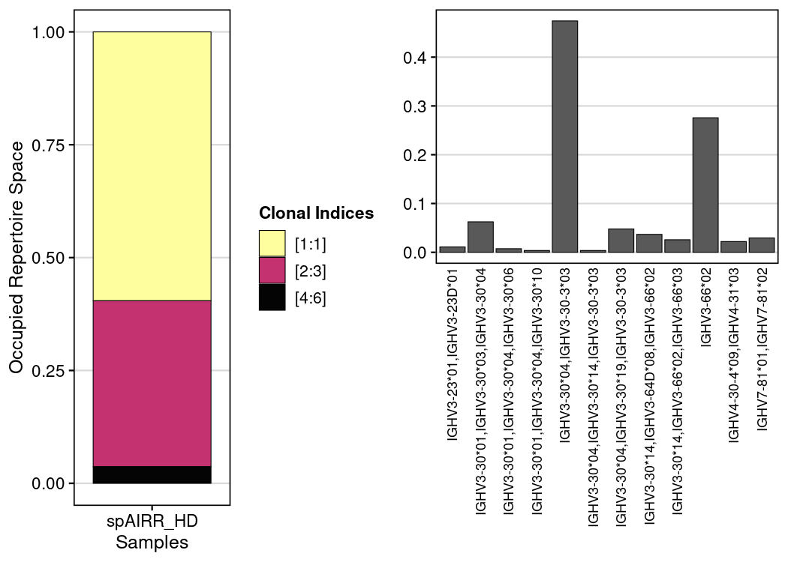

**Part 3**: Interoperability with `scRepertoire`
================

This vignette provides a starting point for analysing spatial AIRR data
generated with LongAIRR. Using a **Visium HD 3’** dataset, we
demonstrate how to:

- load and inspect a LongAIRR AIRR rearrangement table
- summarize the receptor repertoire and assign IGH clones using SCOPer
- visualize clone distributions using LongAIRR spatial coordinates
- combine LongAIRR output with matching Space Ranger results and
- import the annotated AIRR table into scRepertoire

This is **Part 3** of the vignette. Refer to the [**Vignette 1 Overview**](./vignette1_overview.md)
or move to [**Part 1**](./longairr_vignette1_part1.md) and [**Part 2**](./longairr_vignette1_part2.md) directly.

---

``` r
library(dplyr)
library(ggplot2)
library(patchwork)
library(purrr)
library(readr)
library(scoper)
library(scRepertoire)
library(shazam)
library(stringr)
library(tibble)
library(cowplot)
```

------------------------------------------------------------------------

scRepertoire is designed around single-cell barcodes. For this
interoperability example, every LongAIRR **UMI-SPBCID molecule group**
is assigned a unique technical `cell_id`. This preserves one
reconstructed molecule as one input unit, but it does **not** convert a
spatial position or molecule group into a biologically resolved cell.
Resulting abundances must therefore be interpreted as molecule counts
rather than cell counts.

------------------------------------------------------------------------

This part uses the `igh_clones` dataframe from [**Part 1**](./longairr_vignette1_part1.md):

``` r
# inspect clone df
igh_clones %>%
  select(sequence_id, v_call, j_call, isotype_sub, junction, clone_id, spbcid, x, y) %>%
  head(8)
```

<div class="kable-table">

<table>

<thead>

<tr>

<th style="text-align:left;">

sequence_id
</th>

<th style="text-align:left;">

v_call
</th>

<th style="text-align:left;">

j_call
</th>

<th style="text-align:left;">

isotype_sub
</th>

<th style="text-align:left;">

junction
</th>

<th style="text-align:left;">

clone_id
</th>

<th style="text-align:left;">

spbcid
</th>

<th style="text-align:right;">

x
</th>

<th style="text-align:right;">

y
</th>

</tr>

</thead>

<tbody>

<tr>

<td style="text-align:left;">

seq827085
</td>

<td style="text-align:left;">

IGHV3-23*01,IGHV3-23D*01
</td>

<td style="text-align:left;">

IGHJ4\*02
</td>

<td style="text-align:left;">

IGHG1
</td>

<td style="text-align:left;">

TGTGCGAAAGTTTACTACGGTGGTAAGGAAATTGACTACTGG
</td>

<td style="text-align:left;">

1
</td>

<td style="text-align:left;">

s_002um_01509_01169-1
</td>

<td style="text-align:right;">

1509
</td>

<td style="text-align:right;">

1169
</td>

</tr>

<tr>

<td style="text-align:left;">

seq848742
</td>

<td style="text-align:left;">

IGHV3-23*01,IGHV3-23D*01
</td>

<td style="text-align:left;">

IGHJ4\*02
</td>

<td style="text-align:left;">

IGHG1
</td>

<td style="text-align:left;">

TGTGCGAAAGTTTACTACGGTGGTAAGGAAATTGACTACTGG
</td>

<td style="text-align:left;">

1
</td>

<td style="text-align:left;">

s_002um_01983_01575-1
</td>

<td style="text-align:right;">

1983
</td>

<td style="text-align:right;">

1575
</td>

</tr>

<tr>

<td style="text-align:left;">

seq849771
</td>

<td style="text-align:left;">

IGHV3-23*01,IGHV3-23D*01
</td>

<td style="text-align:left;">

IGHJ4\*02
</td>

<td style="text-align:left;">

IGHG1
</td>

<td style="text-align:left;">

TGTGCGAAAGTTTACTACGGTGGTAAGGAAATTGACTACTGG
</td>

<td style="text-align:left;">

1
</td>

<td style="text-align:left;">

s_002um_01983_01575-1
</td>

<td style="text-align:right;">

1983
</td>

<td style="text-align:right;">

1575
</td>

</tr>

<tr>

<td style="text-align:left;">

seq769398
</td>

<td style="text-align:left;">

IGHV3-30*04,IGHV3-30-3*03
</td>

<td style="text-align:left;">

IGHJ4\*02
</td>

<td style="text-align:left;">

IGHM
</td>

<td style="text-align:left;">

TGTGCGAGAGGCCGTGGCTACTGCCTTGACTACTGG
</td>

<td style="text-align:left;">

2
</td>

<td style="text-align:left;">

s_002um_02959_00234-1
</td>

<td style="text-align:right;">

2959
</td>

<td style="text-align:right;">

234
</td>

</tr>

<tr>

<td style="text-align:left;">

seq758830
</td>

<td style="text-align:left;">

IGHV3-30*04,IGHV3-30-3*03
</td>

<td style="text-align:left;">

IGHJ4\*02
</td>

<td style="text-align:left;">

IGHM
</td>

<td style="text-align:left;">

TGTGCGAGAGGCCGTGGGAGCTACTGCCTTGACTACTGG
</td>

<td style="text-align:left;">

3
</td>

<td style="text-align:left;">

s_002um_02952_00233-1
</td>

<td style="text-align:right;">

2952
</td>

<td style="text-align:right;">

233
</td>

</tr>

<tr>

<td style="text-align:left;">

seq763377
</td>

<td style="text-align:left;">

IGHV3-30*04,IGHV3-30-3*03
</td>

<td style="text-align:left;">

IGHJ4\*02
</td>

<td style="text-align:left;">

IGHM
</td>

<td style="text-align:left;">

TGTGCGAGAGGCCGTGGGAGCTACTGCCTTGACTACTGG
</td>

<td style="text-align:left;">

3
</td>

<td style="text-align:left;">

s_002um_01325_00232-1
</td>

<td style="text-align:right;">

1325
</td>

<td style="text-align:right;">

232
</td>

</tr>

<tr>

<td style="text-align:left;">

seq765013
</td>

<td style="text-align:left;">

IGHV3-30*04,IGHV3-30*19,IGHV3-30-3\*03
</td>

<td style="text-align:left;">

IGHJ4\*02
</td>

<td style="text-align:left;">

IGHM
</td>

<td style="text-align:left;">

TGTGCGAGAGGCCGTGGGAGCTACTGCCTTGACTACTGG
</td>

<td style="text-align:left;">

3
</td>

<td style="text-align:left;">

s_002um_02952_00230-1
</td>

<td style="text-align:right;">

2952
</td>

<td style="text-align:right;">

230
</td>

</tr>

<tr>

<td style="text-align:left;">

seq765097
</td>

<td style="text-align:left;">

IGHV3-30*04,IGHV3-30-3*03
</td>

<td style="text-align:left;">

IGHJ4\*02
</td>

<td style="text-align:left;">

IGHM
</td>

<td style="text-align:left;">

TGTGCGAGAGGCCGTGGGAGCTACTGCCTTGACTACTGG
</td>

<td style="text-align:left;">

3
</td>

<td style="text-align:left;">

s_002um_02953_00230-1
</td>

<td style="text-align:right;">

2953
</td>

<td style="text-align:right;">

230
</td>

</tr>

</tbody>

</table>

</div>

## Import the annotated AIRR table into scRepertoire

``` r
SAMPLE_LABEL <- "spAIRR_HD"

sc_airr_input <- igh_clones %>%
  mutate(cell_id = as.character(group))

group_clone_conflicts <- sc_airr_input %>%
  distinct(cell_id, clone_id) %>%
  count(cell_id, name = "n_clone_ids") %>%
  filter(n_clone_ids > 1)

sc_airr_list <- list(as.data.frame(sc_airr_input))
names(sc_airr_list) <- SAMPLE_LABEL

sc_contig_list <- scRepertoire::loadContigs(input = sc_airr_list, format = "AIRR")
sc_bcr <- scRepertoire::combineBCR(input.data = sc_contig_list, samples = SAMPLE_LABEL, chain = "IGH")
```

`combineBCR()` reshapes the AIRR input and may prefix its technical
barcode (append the sample-name to the group-ID,
e.g. `spAIRR_HD_AATACTAGTs_002um_00717_00138-1`). The earlier annotated
**clone_id** is omitted during this process. We therefore join it back
using the original molecule-group identifier (umi-spbcid)

``` r
#lookup (umi_spbcid) to cloneid
sc_clone_lookup <- sc_airr_input %>%
  transmute(group_for_join = as.character(cell_id),
            clone_id = as.character(clone_id)) %>%
  distinct()

# merges back the clone_id to the corresponding group ID using lookup // required to restore SCOPer clone IDs 
sc_bcr <- purrr::imap(sc_bcr,
  function(df, sample_name) {
    df %>%
      select(-any_of("clone_id")) %>%
      mutate(group_for_join = stringr::str_remove(as.character(barcode), paste0("^", SAMPLE_LABEL, "_"))) %>%
      left_join(sc_clone_lookup, by = "group_for_join")
  }
)
```

scRepertoire provides several functions for repertoire-exploration that
serve as a starting point for every downstream analysis. Below are two
examples:

``` r
#used functions expect previous use of combineBCR or combineTCR
p_sc_prop <- scRepertoire::clonalProportion(input.data = sc_bcr,
                                            clone.call = "clone_id",
                                            clonal.split = c(1, 3, length(unique(sc_bcr$spAIRR_HD$clone_id))),
                                            chain = "IGH")

# IGHv genes overview
p_sc_genes <- scRepertoire::vizGenes(sc_bcr, x.axis = "IGHV", y.axis = NULL,
                                     plot = "barplot", summary.fun = "proportion") 

p_screp_combined <- plot_grid(p_sc_prop, p_sc_genes, ncol=2)
p_screp_combined
```

<!-- -->

------------------------------------------------------------------------

Move to the vignette overview to explore **Part 1** and **Part 2** of
this vignette.

------------------------------------------------------------------------

# Additional resources

- [LongAIRR GitHub repository](https://github.com/AGImkeller/LongAIRR)  
  Source code, installation instructions, example workflows and issue
  tracker.

- [LongAIRR-Whitelist GitHub
  repository](https://github.com/AGImkeller/LongAIRR_whitelist)  
  Companion workflow for generating sample-specific Visium HD 3′
  spatial-barcode indices.  
  *This link will become available once the repository is public.*

- [AIRR Community Data
  Standards](https://docs.airr-community.org/en/latest/datarep/overview.html)  
  Standards for representing and exchanging adaptive immune receptor
  repertoire data.

- [AIRR Rearrangement
  schema](https://docs.airr-community.org/en/latest/datarep/rearrangements.html)  
  Definitions of the standardized fields used in AIRR rearrangement
  tables.

- [Immcantation
  documentation](https://immcantation.readthedocs.io/en/stable/)  
  Framework for AIRR-seq processing and downstream repertoire analysis.

- [SCOPer documentation](https://scoper.readthedocs.io/)  
  Methods for assigning B-cell clonal relationships from AIRR-formatted
  data.

- [scRepertoire on
  Bioconductor](https://bioconductor.org/packages/scRepertoire/)  
  Installation, reference manual and vignettes for single-cell
  immune-receptor analysis.

- [scRepertoire GitHub
  repository](https://github.com/BorchLab/scRepertoire)  
  Source code, examples and issue tracker.

------------------------------------------------------------------------

# Session Information

``` r
sessionInfo()
```

    ## R version 4.6.0 (2026-04-24)
    ## Platform: x86_64-pc-linux-gnu
    ## Running under: Ubuntu 22.04.5 LTS
    ## 
    ## Matrix products: default
    ## BLAS:   /usr/lib/x86_64-linux-gnu/blas/libblas.so.3.10.0 
    ## LAPACK: /usr/lib/x86_64-linux-gnu/lapack/liblapack.so.3.10.0  LAPACK version 3.10.0
    ## 
    ## locale:
    ##  [1] LC_CTYPE=en_US.UTF-8       LC_NUMERIC=C              
    ##  [3] LC_TIME=en_US.UTF-8        LC_COLLATE=en_US.UTF-8    
    ##  [5] LC_MONETARY=en_US.UTF-8    LC_MESSAGES=en_US.UTF-8   
    ##  [7] LC_PAPER=en_US.UTF-8       LC_NAME=C                 
    ##  [9] LC_ADDRESS=C               LC_TELEPHONE=C            
    ## [11] LC_MEASUREMENT=en_US.UTF-8 LC_IDENTIFICATION=C       
    ## 
    ## time zone: Etc/UTC
    ## tzcode source: system (glibc)
    ## 
    ## attached base packages:
    ## [1] stats     graphics  grDevices utils     datasets  methods   base     
    ## 
    ## other attached packages:
    ##  [1] cowplot_1.2.0      tibble_3.3.1       stringr_1.6.0      shazam_1.3.2      
    ##  [5] scRepertoire_2.8.0 scoper_1.5.0       readr_2.2.0        purrr_1.2.2       
    ##  [9] patchwork_1.3.2    ggplot2_4.0.3      dplyr_1.2.1       
    ## 
    ## loaded via a namespace (and not attached):
    ##   [1] RColorBrewer_1.1-3          ggdendro_0.2.0             
    ##   [3] rstudioapi_0.18.0           jsonlite_2.0.0             
    ##   [5] magrittr_2.0.5              farver_2.1.2               
    ##   [7] iNEXT_3.0.2                 rmarkdown_2.31             
    ##   [9] vctrs_0.7.3                 memoise_2.0.1              
    ##  [11] Rsamtools_2.28.0            airr_1.6.1                 
    ##  [13] htmltools_0.5.9             S4Arrays_1.12.0            
    ##  [15] progress_1.2.3              SparseArray_1.12.2         
    ##  [17] parallelly_1.47.0           evmix_2.12                 
    ##  [19] KernSmooth_2.23-26          plyr_1.8.9                 
    ##  [21] cachem_1.1.0                GenomicAlignments_1.48.0   
    ##  [23] igraph_2.3.1                lifecycle_1.0.5            
    ##  [25] iterators_1.0.14            pkgconfig_2.0.3            
    ##  [27] Matrix_1.7-5                R6_2.6.1                   
    ##  [29] fastmap_1.2.0               MatrixGenerics_1.24.0      
    ##  [31] future_1.70.0               digest_0.6.39              
    ##  [33] immApex_1.6.0               S4Vectors_0.50.0           
    ##  [35] GenomicRanges_1.64.0        labeling_0.4.3             
    ##  [37] progressr_0.19.0            alakazam_1.4.3             
    ##  [39] polyclip_1.10-7             abind_1.4-8                
    ##  [41] compiler_4.6.0              withr_3.0.2                
    ##  [43] doParallel_1.0.17           gsl_2.1-9                  
    ##  [45] S7_0.2.2                    BiocParallel_1.46.0        
    ##  [47] viridis_0.6.5               ggforce_0.5.0              
    ##  [49] MASS_7.3-65                 quantreg_6.1               
    ##  [51] DelayedArray_0.38.1         rjson_0.2.23               
    ##  [53] tools_4.6.0                 otel_0.2.0                 
    ##  [55] ape_5.8-1                   future.apply_1.20.2        
    ##  [57] glue_1.8.1                  nlme_3.1-169               
    ##  [59] grid_4.6.0                  reshape2_1.4.5             
    ##  [61] ade4_1.7-24                 generics_0.1.4             
    ##  [63] seqinr_4.2-44               gtable_0.3.6               
    ##  [65] tzdb_0.5.0                  tidyr_1.3.2                
    ##  [67] data.table_1.18.4           hms_1.1.4                  
    ##  [69] tidygraph_1.3.1             sp_2.2-1                   
    ##  [71] XVector_0.52.0              BiocGenerics_0.58.0        
    ##  [73] ggrepel_0.9.8               foreach_1.5.2              
    ##  [75] pillar_1.11.1               spam_2.11-3                
    ##  [77] splines_4.6.0               tweenr_2.0.3               
    ##  [79] lattice_0.22-9              survival_3.8-6             
    ##  [81] SparseM_1.84-2              tidyselect_1.2.1           
    ##  [83] SingleCellExperiment_1.34.0 Biostrings_2.80.0          
    ##  [85] knitr_1.51                  gridExtra_2.3              
    ##  [87] IRanges_2.46.0              Seqinfo_1.2.0              
    ##  [89] SummarizedExperiment_1.42.0 stats4_4.6.0               
    ##  [91] xfun_0.57                   graphlayouts_1.2.5         
    ##  [93] Biobase_2.72.0              diptest_0.77-2             
    ##  [95] matrixStats_1.5.0           stringi_1.8.7              
    ##  [97] lazyeval_0.2.3              yaml_2.3.12                
    ##  [99] evaluate_1.0.5              codetools_0.2-19           
    ## [101] cigarillo_1.2.0             ggraph_2.2.2               
    ## [103] cli_3.6.6                   Rcpp_1.1.1-1.1             
    ## [105] globals_0.19.1              fastcluster_1.3.0          
    ## [107] parallel_4.6.0              MatrixModels_0.5-4         
    ## [109] prettyunits_1.2.0           dotCall64_1.2              
    ## [111] ggalluvial_0.12.6           bitops_1.0-9               
    ## [113] listenv_0.10.1              viridisLite_0.4.3          
    ## [115] scales_1.4.0                SeuratObject_5.4.0         
    ## [117] crayon_1.5.3                rlang_1.2.0
