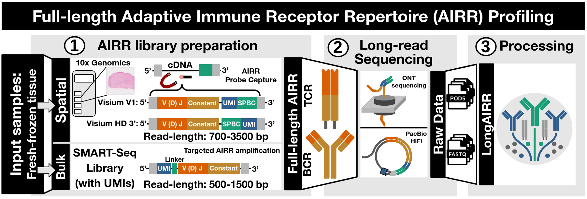
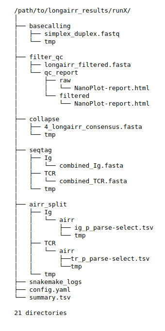

 
# LongAIRR - Extended Documentation 

This README provides are more detailed introduction to **LongAIRR**, including detailed
parameter descriptions for the different **LongAIRR** modules. We will also highlight some
advanced use-cases.

<p align="center">
  
</p>

## Table of Content

* [Compatible Library Preparation Protocols](#compatible-library-preparation-protocols)
* [LongAIRR Snakemake Example Workflows](#longairr-snakemake-example-workflows)
  * [Snakemake Background](#background)
  * [Spatial LongAIRR Snakemake Workflow](#spatial-longairr-snakemake-workflow)
    * [Parameter Overview](#parameter-overview)
    * [Workflow usage](#usage)
    * [Output Directories](#output-directories)
* [Used External Software](#used-external-software)
* [Citation](#citation)
* [Authors / Contact](#authors)

___

## Compatible Library Preparation Protocols

  * [**SPATIAL**] [10x Visium V1 - Spatial Gene Expression Vers.: CG000239 RevF](https://www.10xgenomics.com/support/spatial-gene-expression-fresh-frozen/documentation/steps/library-construction/visium-spatial-gene-expression-reagent-kits-user-guide)
  * [**SPATIAL**] [10x Visium HD 3' - Spatial Gene Expression Vers.: CG000805 RevB](https://www.10xgenomics.com/support/spatial-gene-expression-hd-three-prime/documentation/steps/library-construction/visium-hd-3-prime-spatial-gene-expression-user-guide)
  * [**BULK**] [SMART-Seq Human BCR (with UMIs)](https://www.takarabio.com/products/next-generation-sequencing/immune-profiling/human-repertoire/smart-seq-human-bcr-with-umis?srsltid=AfmBOoqz0SB9vJtwLHpGINeMqu9hOhdTcYTiH2PtZP4P2h7OG2y7NGmy)

## LongAIRR Snakemake Example Workflows

### Background

Using Workflow Managers such as Snakemake to streamline the usage of multiple tools in a workflow has several advantages over
simple bash scripts. One that is the parallelization of processing steps that can be
run independently without affecting each other. Find more information about snakemake [here](https://snakemake.github.io/).
The modular design of **LongAIRR** fits into the rule-based Snakemake logic (...)

In this version, we are providing two Snakemake workflows that integrate **LongAIRR modules 2-6** to streamline full-length
adaptive immune receptor profiling from spatial and bulk AIRR libraries. Since ONT basecalling (LongAIRR module 1), is restricted
to GPU-processing, the workflows expect

Each workflow includes one **snakefile**, containing rules for step-wise data-processing, and one **config.yaml**, where users provide all LongAIRR runtime parameters which are passed to the rules.

> [!Important]
> 
> * [Visium V1 / Visium HD 3' Workflow:](../longairr_example_workflow/snakemake/visium/)
> * [SMART-Seq (with UMIs)](../longairr_example_workflow/snakemake/bulk/)

### Spatial LongAIRR Snakemake Workflow

#### Parameter Overview

Essential parameters that need to be provided by the user:

 ***Input / Output***
 * `INPUT_FASTQ`, path to input FASTQ files. **ONT**: *longairr basecall* output: simplex.fastq, simplex_duplex.fastq or duplex.fastq or custom naming. **PacBio** fastq files.
 * `COLLAPSE_ANCHOR_FASTA`, path to fasta file containing anchor sequences to determine UMI and spatial barcode sequence sequences. Refer to [Module description: *longairr collapse*](../README.md)
 * `VISIUM_SPBC_TXT`, spatial barcode whitelist containing the nucleotide sequences for **Visium V1** datasets. Same scheme for **Visium HD 3'** datasets, providing two lists `VISIUMHD_SPBC1_TXT` and `VISIUMHD_SPBC2_TXT` that contain the corresponding nucleotide sequences from the spatial barcodes in the Visium HD 3' technology.
 * `SEQTAG_FASTA`, path to fasta file containing anchor sequences e.g., for constant segment annotation / splitting sequences by BCR and TCR locus. Headers of the provided sequences should match (partially) with values provided in `SEQTAG_SPLIT_REGEX` (see below)
 * `DATABASE_PARENT`, path to parent directory containing reference databases. If the references where set up during LongAIRR installation, providing the `path/to/databases/` path is sufficient. The workflow looks for `/igblast` and `/germlines/imgt/humand/vdj/` subdirectories within the provided parent. Check the [**Installation and Setup section**](../README.md) to revisit setting up the references during LongAIRR installation 
 * `OUTPUT`, path to desired output directory. If basecalling was performed with *longairr basecall*, state the directory that contains basecalling output.
 * `CONFIG_PATH` path to used snakemake **config.yaml** if `COPY_CONFIG: TRUE` was specified, which then copies the **config.yaml** in the stated `OUTPUT` directory. This allows revisting the used parameters for every processed dataset.

 ***Initial quality and length filtering***
 * [**Filter parameters**]: `FILTER_MIN_QUAL`, `FILTER_MIN_L`, `FILTER_MAX_L`, for inital quality and fixed length filtering. Set length filters to `-1` if not desired.

 ***Sequence library and Sequence groups***
 * **`COLLAPSE_LIBRARY`**: Valid values are `"visium"` and `"visiumhd"` corresponding to the used spatial [library protocol](#compatible-library-preparation-protocols)
 * **`COLLAPSE_GROUP_FIELD`**: Valid values are `"SPBCUMI"` for **Visium V1** based datasets, and `"UMISPBC"` for **Visium HD 3'** based datasets. This logic corresponds to the underlying arrangement of UMI and SPBC segments within the respective library-specific read-structures.

 ***Adaptive filtering***
 * `COLLAPSE_AF = TRUE | FALSE` to toggle adaptive filtering, `COLLAPSE_AF_MIN_N`, to specify the minimal sequence group size to perform adaptive filtering on (default (5)). `COLLAPSE_AF_BIN`, and `COLLAPSE_AF_MARGIN`, to specify bin size and margin around the determined peak-length to retain within this range.
 
 ***Split Sequences by Locus (BCR / TCR)***
 * `SEQTAG_SPLIT_REGEX`, values provided here in a list need to match e.g., with the identifiers of provided anchor sequences in the `SEQTAG_FASTA` input file. `SEQTAG_regex` needs to match these values, split into separate lines. Internal parameter to determine file-naming by Snakemake rules.
 * `locus_igblast`, valid values are `"ig"` and/or `"tr"` passed to igblast. Provide both, seperated into new lines if have a **combined BCR / TCR library** and split sequences by locus.
 
 ***Performance / Speed***
 * `COLLAPSE_N_SUBSAMPLE` determines the maximal number of reads to keep for every sequence group. Sequence groups containing more reads will be subsamples with the specified random seed `COLLAPSE_SEED`.
 * `COLLAPSE_N_CHUNK` determines the number of sequence groups chunked into separate files. Number of reads across chunks will be overall similar. Specify the number of chunks that are processed in parallel during multiple sequence alignment and consensus building.

<br>

___

#### Usage

Follow the steps below to run the snakemake workflows from the command line:

Make sure the `longairr` conda environment is **activated**:

```
conda activate longairr
```

Run **snakemake** and specify the correct snakefile and config file:

```
snakemake --cores 12 -s path/to/longairr_example_workflow/snakemake/visium/snakefile_visium_hd --config path/to/longairr_example_workflow/snakemake/visium/config.yaml
```

This will run the snakemake workflow and save the results in the directory stated in the
**`OUTPUT`** directory in the config.yaml.
<br>

___

#### Output Directories

The following results were generated with the `snakemake/visium/snakefile_visium_hd` example workflow. The used config file was copied in the `OUTPUT` directory



**TODO change the text here**

The output structure of a **spatial** sample can be observed on the right. In this case, **longairr demux** was not performed,
however the sample includes receptor data from the immunoglobulin ('ig') and tcr ('tr') locus, which is why the output from **longairr seqtag** and **airr_split** directories 
are split into additional subfolders.

- Results from **longairr basecall** are saved in `/basecalling/`

- Results from **longairr filter** are saved in `/filter_qc/` with quality reports in html format
  for raw and filtered data being saved in `/filter_qc/qc_reports/raw/` and `filter_qc/qc_reports/filtered/` respectively.

- Results from **longairr collapse** are saved in `/collapse/`. The 4_longairr_consensus.fasta contains all consensus sequences with shared UMI-SPBC identifiers and will be passed to the next module.

- Results from **longairr seqtag** are saved in `/seqtag/` and split by locus (`Ig` for Immunoglobulin) and (`TCR` for T cell receptors). These values are passed as REGEX in the config file and match a 
  part of the headers in the provided FASTA file that contains short anchor sequences matching to constant receptor sequence segments.

- Results from **longairr airr** are saved in the parent directory `/airr_split/`and are also split into subdirectories `/Ig/airr/` and `/TCR/airr`. 
  Here users will find the final AIRR tables with productive receptor information, e.g., ig_p_parse-select.tsv and tr_p_parse-select.tsv

- `/tmp/` directories contain intermediate files that can be used for troubleshooting.

The figure additionaly shows the naming of the most important files, e.g., the main output from each longairr module, which would be used to pass the results from one module to the next one, when using LongAIRR manually and not with Snakemake.

## Used External Software

Used third-party software is listed and referenced within the [**software_references**](./software_references.md) file.

___
[**BACK TO TOP**](#Table-of-Content)
___

# Citation

--

___

# Authors

[Jonas Schuck](https://github.com/Jonas-Schuck), [Katharina Imkeller](https://github.com/imkeller)

**Contact**: Schuck@med.uni-frankfurt.de

**Issues/Bug-report:**: [LongAIRR-Issues](https://github.com/AGImkeller/LongAIRR/issues)

___
[**BACK TO TOP**](#Table-of-Content)
___